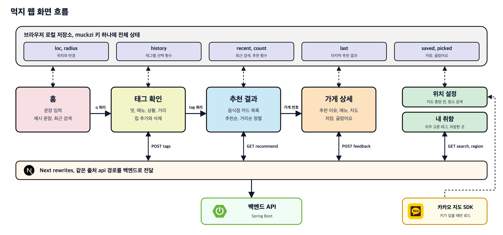

# 먹지 웹

먹지 서비스의 웹 화면으로, 사용자가 먹고 싶은 것을 문장으로 말하면 태그로 정리해 보여 주고 확정한 태그로 주변 음식점 추천을 받아 온다

로그인과 서버 데이터베이스 없이 브라우저 저장소에 취향과 기록을 쌓는다

## 화면 흐름도



## 기술 구성

| 구분 | 내용 |
|---|---|
| 프레임워크 | Next 16 App Router |
| UI | React 19, TypeScript |
| 지도 | Kakao Maps JavaScript SDK |
| 상태 관리 | 브라우저 로컬 저장소와 React 외부 스토어 구독 |
| 스타일 | 전역 CSS 디자인 토큰, UI 라이브러리 미사용 |
| 글꼴 | Noto Sans KR |

런타임 의존성은 next, react, react dom 세 개뿐이다

## 화면 구성

```
/              홈, 문장 입력, 예시 문장, 최근 검색 3개
/tags          태그 확인, AI가 정리한 맛, 메뉴, 상황, 거리 태그 편집
/results       추천 결과, 음식점 카드 목록, 추천순과 거리순 정렬, 만족도 피드백
/place/[id]    가게 상세, 추천 이유, 대표 메뉴와 가격, 지도, 저장, 골랐어요
/location      위치 설정, 지도 중앙 핀, 장소 검색, 반경 선택
/me            내 취향, 자주 고른 태그와 피하는 태그, 저장한 가게
```

| 구성 요소 | 역할 |
|---|---|
| Navbar | 상단 메뉴, 현재 위치와 반경 표시, 첫 방문 시 위치 자동 감지 |
| Feedback | 좋아요와 별로예요 전송 |
| kakao | 카카오 지도 SDK를 한 번만 불러오는 훅 |
| ui | 아이콘, 경로 표시, 빈 화면과 오류 화면, 사진 컴포넌트 |
| store | 로컬 저장소 기반 전역 상태와 표시용 도우미 함수 |

## 사용자 흐름

- 홈에서 입력한 문장은 주소의 쿼리 값으로만 넘기므로 뒤로 가기, 새로고침, 링크 공유가 모두 주소로 복원된다
- 태그 확인 화면은 백엔드의 태그 API로 받은 태그를 맛, 메뉴, 상황 그룹별 칩으로 보여 준다
- 사용자는 칩을 빼거나 새 태그를 더할 수 있고, 거리 칩은 누를 때마다 300미터, 500미터, 1킬로미터, 2킬로미터를 순환한다
- 이 조건으로 찾기를 누르면 태그별 사용 횟수와 최근 검색을 저장하고 태그 목록을 결과 화면 주소로 넘긴다
- 결과 화면은 태그를 공백으로 이어 붙인 문자열을 질의로 추천 API를 부르므로 원래 문장이 아니라 사용자가 고친 태그가 검색 조건이 된다
- 추천 응답은 마지막 결과로 저장해 가게 상세 화면과 태그 없이 다시 들어온 경우에 재사용한다
- 결과가 없으면 한 단계 넓은 반경을 제안하고 버튼 하나로 반경을 넓힌다
- 가게 상세는 서버에 다시 묻지 않고 마지막 결과와 저장한 가게 목록에서 가게 번호로 찾는다

## 핵심 로직

### 상태 관리

별도 상태 라이브러리 없이 로컬 저장소의 muckzi 키 하나에 전체 상태를 JSON으로 두고 useSyncExternalStore로 구독한다

- 저장된 원문 문자열이 바뀌었을 때만 다시 파싱해 같은 객체를 돌려주므로 스냅샷 동일성 조건을 지킨다
- 갱신 함수는 바뀐 필드만 병합해 저장하고 사용자 정의 이벤트를 발생시켜 같은 탭의 화면을 갱신한다
- 다른 탭의 변경은 브라우저 storage 이벤트로 받는다
- 저장값에 기본값을 먼저 깔고 병합하므로 필드가 추가되어도 예전 데이터가 깨지지 않는다
- 사생활 보호 모드처럼 저장소 접근이 실패하면 기본값으로 동작한다
- 서버 렌더링 시점에는 기본값을 스냅샷으로 쓴다

| 상태 | 쓰임 |
|---|---|
| loc, radius | 검색 위치와 반경, 기본값은 성공회대 정문과 500미터 |
| history | 태그별 선택 횟수와 피하는 태그 여부, 내 취향 화면의 원천 |
| recent, count | 최근 검색 5개, 누적 추천 횟수 |
| last | 마지막 추천의 태그와 결과 |
| saved, picked | 저장한 가게 전체 정보, 골랐어요를 누른 가게 번호 |

### 서버 연동

- 브라우저는 항상 같은 출처의 api 경로만 부르고, Next 설정의 rewrites가 이를 백엔드 주소로 넘기므로 CORS 설정이 필요 없다
- 위치 이름은 브라우저 위치 좌표를 지역 API로 보내 행정동 이름으로 바꾼다
- 첫 방문으로 저장값이 없을 때만 Navbar가 위치 감지를 한 번 시도한다
- 요청 실패는 화면별 오류 상태로 보여 주고 다시 시도 버튼을 둔다

### 피드백

- 결과 화면의 좋아요와 별로예요는 같은 메뉴 검색어마다 한 번만 보낸다
- 가게 상세의 이 추천이 잘 맞았나요는 추천 결과에서 들어온 가게에만 보여 준다
- 이걸로 골랐어요는 골랐음 표시를 함께 보내며 AI 서버는 이를 좋아요 두 번으로 센다
- 전송 결과를 기다리지 않고 실패는 무시해 화면 흐름을 막지 않는다

### 추천 이유 문장

가게 메뉴판에서 추천 메뉴를 확인했으면 메뉴 이름과 가격을, 확인하지 못했으면 조건에 잘 맞는 메뉴 이름을 넣고 도보 시간을 붙여 추천 이유를 만든다

도보 시간은 분당 67미터로 계산한다

$$
\text{walk}(d) = \max\left(1,\ \operatorname{round}\left(\frac{d}{67}\right)\right)
$$

### 지도

- 지도 SDK는 자바스크립트 키가 있을 때만 자동 로드를 끈 상태로 한 번 삽입하고, 로드가 끝나면 준비 상태를 참으로 바꾼다
- 이미 삽입된 스크립트는 표식 속성으로 찾아 다시 쓴다
- 위치 설정 화면은 핀을 CSS로 지도 중앙에 고정하고 지도가 멈출 때 중심 좌표를 읽는다
- 장소 검색 결과로 이동할 때는 장소 이름을 미리 넣어 두어 좌표 변환 요청을 건너뛴다
- 키가 없으면 위치 설정은 장소 검색만, 가게 상세는 카카오맵 링크로 대신한다

### UI

- 어두운 테마 하나의 디자인 토큰을 루트에 두고 카드, 칩, 버튼 같은 전역 클래스로 화면을 조합한다
- 아이콘은 public 폴더의 SVG 파일을 이미지로 불러온다
- 외부 음식 사진은 리퍼러 없이 불러오고 실패하면 카메라 아이콘으로 바꾼다
- 로딩은 스켈레톤으로, 빈 결과와 오류와 데이터 없음은 하나의 상태 화면 컴포넌트로 통일했다

## 실행 방법

백엔드가 8080 포트에서 떠 있어야 한다

```bash
npm install
npm run dev
```

```
BACKEND_URL                 백엔드 주소, 기본값 http://localhost:8080
NEXT_PUBLIC_KAKAO_JS_KEY    카카오 지도 자바스크립트 키, 없으면 지도 없이 동작
```
